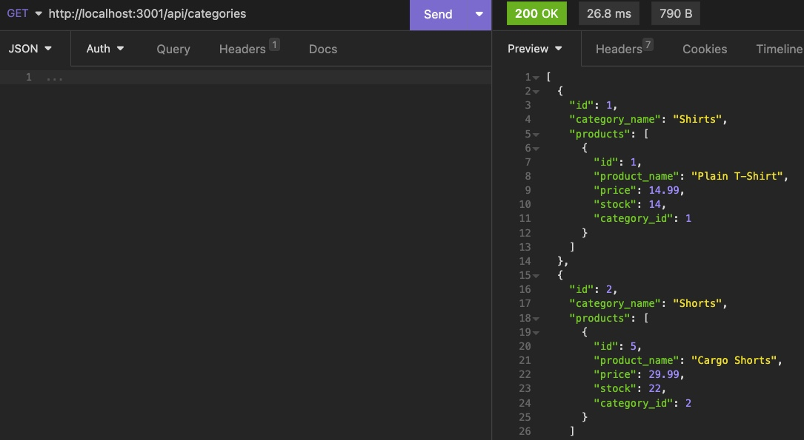

# e-commerce-back-end

## Technology Used 

| Technology Used         | Resource URL           | 
| ------------- |:-------------:| 
| Git | [https://git-scm.com/](https://git-scm.com/)     | 
| Node.js | [https://nodejs.org/api/cli.html](https://nodejs.org/api/cli.html)   |
| MySQL | [https://www.mysql.com/](https://www.mysql.com/)   |
| NPM | [https://www.npmjs.com/](https://www.npmjs.com/)   |
| mysql2 | [https://www.npmjs.com/package/mysql2](https://www.npmjs.com/package/mysql2)   |
| dotenv | [https://www.npmjs.com/package/dotenv?activeTab=readme](https://www.npmjs.com/package/dotenv?activeTab=readme)   |
| Sequelize | [https://sequelize.org/](https://sequelize.org/)   |
| Insomnia | [https://insomnia.rest/download](https://insomnia.rest/download)   |
| Express | [https://expressjs.com/](https://expressjs.com/)   |


## Description 

 Walkthrough Video [https://drive.google.com/file/d/1YF19Ex6JgM9sWn0iKCNXlFTo6J23lAa6/view]

This program stores information in a database for a retail store. Users can reference the data via Insomnia, in which they can see information on different items and categories that the store has. They can also add items and edit their information as well.


## Table of Contents 

* [Javascript Example](#javascript-example)
* [Usage](#usage)
* [Learning Points](#learning-points)
* [Author Info](#author-info)


## Javascript Example

To get a hold of this project, simply navigate to my Github profile and select the repo "e-commerce-back-end". From there copy the SSH link into your terminal, Gitbash, or whatever application you prefer and use git copy and then paste the link. You can then open it using VS Code and run it using node and view it in Insomnia.


```javascript
   id: {
      type: DataTypes.INTEGER,
      allowNul: false,
      primaryKey: true, 
      autoIncrement: true, 
    },
    product_name: {
      type: DataTypes.STRING,
      allowNull: false,
    },
    price: {
      type: DataTypes.DECIMAL(10,2),
      allowNull: false, 
      validate: {
        isDecimal: true
      }
```

In the above code, I set up the fields and rules for all the models.

```javascript
router.get('/', async(req, res) => {
  // find all categories
  // be sure to include its associated Products
  try {
    const categoryData = await Category.findAll( {
      include: [{ model: Product }],
    });

    res.status(200).json(categoryData);
  } catch (err) {
    res.status(500).json(err);
  }
  
```

Used the .get method for all api routes to view the data in Insomnia. Similar methods were used for .post, .put, and .delete.


## Usage 
To use the employee tracker, you must first acquire it through GitHub, see above how to do this. After you open it in VS Code, you may then use your computer's terminal or the terminal in VS Code. Make sure you are inside this repository in the terminal, and run "npm install" and then log on to mysql and create the data base using "source schema.sql" or "CREATE DATABASE ecommerce_db;". After that run "npm start" or "node server.js". Open up Insomnia and copy the port link and add /api/categories, products, or tags to view, add, or delete the data you want. 


</br>

</br>


## Learning Points 


Through this project, I got a really good understanding of Insomnia and how make get, post, put, and delete requests. I also got a good understanding for constructing api routes.


## Author Info


### Sam Higa 


* [Portfolio](https://samhiga.github.io/my-portfolio/)
* [LinkedIn](https://www.linkedin.com/in/sam-higa-b887b9209/)
* [Github](https://github.com/samhiga)